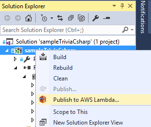
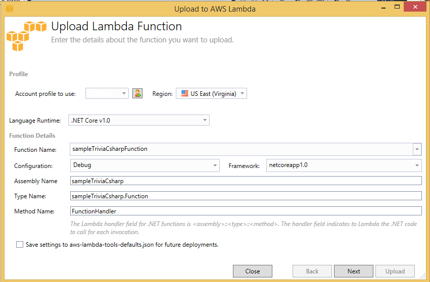
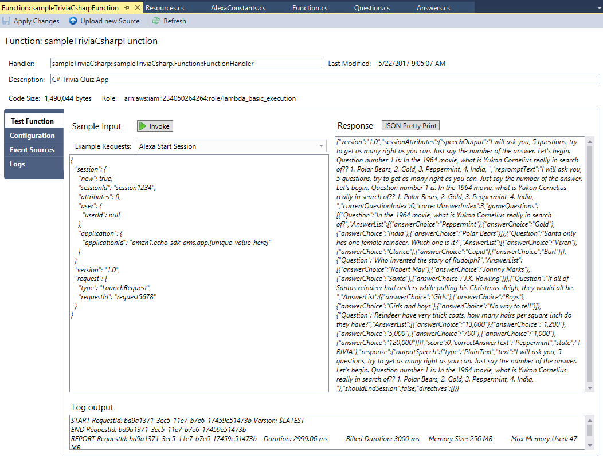

# C# Setup

## Setting up your AWS Lambda C# development environment

To use C# for AWS Lambda development a number of components must be installed in your development environment, these are:

1.  **Visual Studio**. We used [Visual Studio Community 2015 Edition Update 3](https://msdn.microsoft.com/en-us/library/e2h7fzkw.aspx). Other, later versions, such as 2017, may also work, but we have not tested them.

2.  The **AWS Toolkit for Visual Studio 2015**. This can be downloaded from the [Amazon Visual Studio site](https://aws.amazon.com/visualstudio/), we used **(v 1.11.6.3)**.  If you have not already done so you will need to create an **AWS account** and a **user profile** which will be used by Visual Studio to upload your projects to AWS Lambda. Detailed information and step by step instructions on how to install the Toolkit and configure your account can be found in the following article [Setting Up the Toolkit for Visual Studio](http://docs.aws.amazon.com/toolkit-for-visual-studio/latest/user-guide/getting-set-up.html).

3.  An installed version of **DotNetCore**, we used [ DotNetCore.1.0.1-SDK.1.0.0.Preview2-003131-x64](https://www.microsoft.com/net/download/core)

4. When the above components have been installed download the **sample C# project** from [GitHub](need link), unzip it and load the solution into Visual Studio. Ensure the solution builds. If you get a **Package restore failed** error select the **Restore Packages** menu option and retry the build. If the project fails to build ensure you have installed [Visual Studio 2015 Tools](https://go.microsoft.com/fwlink/?LinkID=827546).

5. Before we can publish we must **configure an account in Visual Studio**. With the details provided in step 2 above, open the **AWS Explorer** window in Visual Studio and select the **New Account Profile** icon. Complete all the fields in the **New Account Profile Dialog**, these include the Access Key Id, Secret Access Key and Account Number. Select the **Ok** button to save. Make sure that the selected region is set to **US East (Virginia)** in the **Region** dropdown in the AWS Explorer. You should now be logged in.

  

6. To publish your C# Function select the **Publish to AWS Lambda** menu option. In the **Upload to AWS Lambda** window titled **Upload Lamda Function** you may wish to tick the ```Save settings to aws-lamda-tools-default.json for future deployment``` option, otherwise click **Next**. In the **Adavanced Function Details** window set a role in the **Role Name** dropdown, if none has been pre-configured select **AWSLamdaBasicExecutionRole**, click **Upload** to start the publishing process.

   

   

   

7. When the upload completes a Lambda test screen should appear. Here you can test basic functionality of your C# Lambda Function. Select **Alexa Start Session** from the **Example Request** dropdown and click the **Invoke** button. A **LaunchRequest** will be sent to your Function, if the **Response** window displays **"null", or "The remote endpoint could not be called, or the response it returned was invalid"** this is an indication that something is broken. AWS Lambda offers additional testing tools to help you troubleshoot your skill.

  


To enable your C# Lambda Function to be called from an Alexa Skill add an **Alexa Skills Kit Trigger** then link the Function's ARN value to an Alexa Skill. This process is described in detail on [Page 2](2-lambda-function.md) of the step-by-step tutorial for this sample skill.
