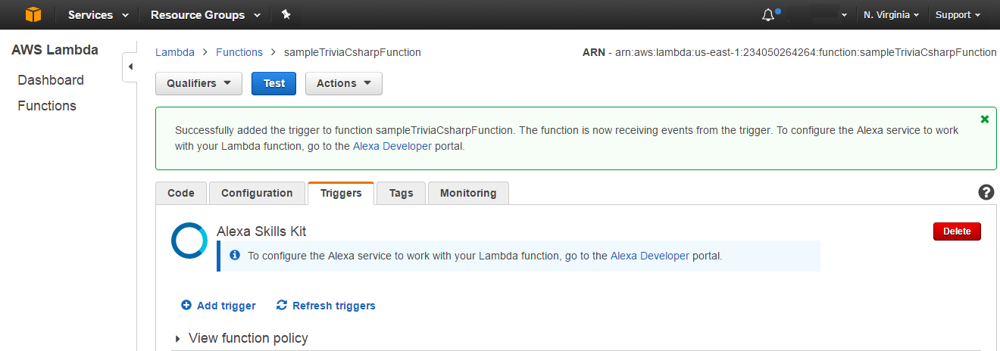

# Build An Alexa Trivia Skill

## Setting Up A Lambda Function Using Amazon Web Services

In the [first step of this guide](https://github.com/alexa/skill-sample-nodejs-fact/blob/master/step-by-step/1-voice-user-interface.md), we built the Voice User Interface (VUI) for our Alexa skill. You can [read more about what a Lambda function is](http://aws.amazon.com/lambda), but for the purposes of this guide, what you need to know is that Lambda is where our code lives.  When a user asks Alexa to use our skill, it is our Lambda function that interprets the appropriate interaction, and provides the conversation back to the user.

1.  In **C#-setup-for-AWS-Lambda.md** (need ref) we describe in detail how to setup your C# development environment and how to build this C# sample project. Please follow that document and now build and upload the sample C# project to the AWS Lambda site. When you have done this **Go to http://aws.amazon.com and sign in to the console**.

2.  Next we must create a **Trigger** to enable the C# Lambda Function previously uploaded to be triggered from an Alexa Skill. Select the **Functions** menu option in the left panel and then select the Lambda function you have just uploaded from the Functions list, it should be at the top. Click the **Add trigger** button and select the **Alexa Skills Kit** option from the dropdown (tip: Clicking the outline square will display the dropdown). Click the **Next** button to create the **Trigger**.  

 

 

 

 

3. Finally, copy the ARN value from the top right corner of the screen, you will need this value in the next section of this guide.

  

